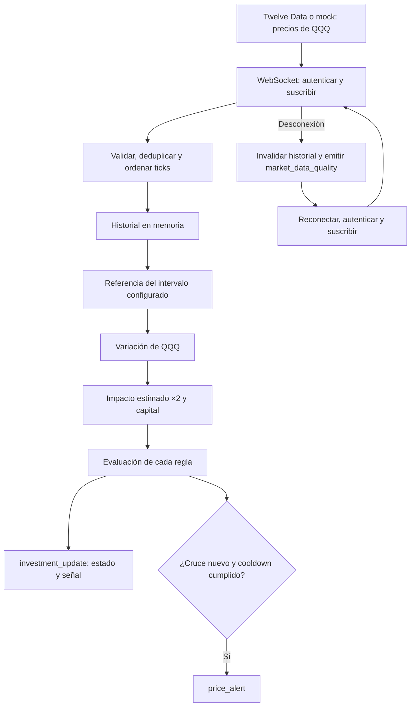

# Lógica de inversión, alertas y endpoints del backend RiTech

> **Prueba real previa a producción, 5 de octubre de 2026:** resultado `NOT_READY`. QQQ: 17 precios recibidos, 17 rechazados como antiguos con límite de 2 s; ninguna entrega ni alerta. Reconexión en 930,64 ms. Los timestamps observados están alineados al minuto. Ver [evidencia completa](../reportes/market_data/twelve_data_live_2026-10-05.json) y el [informe actualizado](INFORME_MIGRACION_TWELVE_DATA.md).


> **Actualización posterior al merge (`93dee59`):** la recuperación Twelve Data inicia una ventana nueva tras cada corte, conserva los ticks persistidos en Redis y excluye el minuto parcial del ATR. Alpaca mantiene su recuperación REST. `recovery.continuity.recoveredThroughMs = 0` indica que Twelve Data no reproduce ticks históricos. Validación actual: 269 pruebas en 24 suites con Redis real, build y lint correctos. Los apartados anteriores de implementación y sus cifras históricas deben leerse junto con el [informe actualizado](INFORME_MIGRACION_TWELVE_DATA.md).


Documento de la implementación actual, actualizado el **5 de octubre de 2026**. Complementa el [plan de implementación](PLAN_WEBSOCKET_MARKET_DATA.md) y describe los contratos disponibles para un consumidor del backend.

## Contenido

1. [Propósito y flujo](#1-propósito-y-flujo)
2. [Historial y cálculo de la inversión](#2-historial-y-cálculo-de-la-inversión)
3. [Señales y generación de alertas](#3-señales-y-generación-de-alertas)
4. [Endpoints HTTP](#4-endpoints-http)
5. [Eventos Socket.IO](#5-eventos-socketio)
6. [Uso recomendado por un consumidor](#6-uso-recomendado-por-un-consumidor)
7. [Archivos responsables](#7-archivos-responsables)
8. [Límites actuales](#8-límites-actuales)

## 1. Propósito y flujo

RiTech analiza una inversión cuyo movimiento estimado equivale al doble de la variación de su referencia. La fuente configurada es **Twelve Data**, mediante su WebSocket de precios para **QQQ**, usado como referencia del Nasdaq 100; el contrato conserva el símbolo QQQ y no lo presenta como el índice oficial NDX.

El backend calcula el impacto, permite configurar umbrales y comunica señales para que el consumidor apoye una decisión humana. No requiere modificar el frontend para consultar los endpoints o verificar los eventos.



Los ejemplos JSON siguientes usan **datos sintéticos**, feed `mock`, precios 100 y 102, capital USD 10.000 y una ventana de cinco minutos. Sus fechas son ilustrativas, están en UTC y no son datos actuales de mercado. Los timestamps deben ser recientes al probar la ingesta: copiar fechas antiguas a un tick real provoca su rechazo por frescura.

### 1.1 Cambio de proveedor sin cambiar la estructura JSON

Las rutas, cuerpos de reglas, campos de respuesta y nombres de eventos conservan su estructura. Cambian los valores que describen el origen: `provider: "twelvedata"`, `feed: "realtime"` en conexión real y `kind: "price"` en el tick. El mock usa `feed: "mock"`. Los cálculos ×2 y las condiciones de alerta siguen siendo los mismos.

Configuración de Twelve Data, sin incluir la clave en archivos versionados:

```dotenv
MARKET_DATA_ENABLED=true
MARKET_DATA_PROVIDER=twelvedata
MARKET_DATA_FEED=realtime
MARKET_DATA_SYMBOL=QQQ
MARKET_DATA_WS_URL=wss://ws.twelvedata.com/v1/quotes/price
TWELVE_DATA_API_KEY=<solo-en-el-env-local>
MARKET_DATA_HEARTBEAT_MS=10000
MARKET_DATA_HEARTBEAT_TIMEOUT_MS=10000
MARKET_DATA_MAX_TICK_AGE_MS=2000
```

El backend autentica al abrir el WebSocket y envía `subscribe` para QQQ. La clave se añade internamente a la URL de conexión; `MARKET_DATA_WS_URL` debe guardarse sin query ni credenciales. La URL autenticada no se registra en logs ni en `/market-data/status`. Si falta `MARKET_DATA_PROVIDER`, se usa `twelvedata`. Alpaca es opcional y requiere selección explícita; nunca se utiliza como fallback de Twelve Data.

Twelve Data entrega precios sin ID de operación. Se asigna un ID local nuevo por observación; no se puede prometer deduplicación de operaciones del proveedor. Esto permite conservar movimientos A → B → A dentro del mismo segundo, sin descartar la vuelta al precio A por un hash repetido.

El `.env.example` deja la ingesta deshabilitada hasta completar una clave propia. En este entorno ya se configuró el `.env` local solicitado. Las claves no se envían a los clientes HTTP/Socket.IO.

Para verificar autenticación/suscripción desde `backend/`, con Node 20:

```bash
node --env-file=../.env -r ts-node/register src/modules/market-data/testing/probe-market-data.ts
```

Para ejecutar el mock, usar `npm run market-data:mock:twelve` y conectar el backend con `MARKET_DATA_PROVIDER=twelvedata`, `MARKET_DATA_FEED=mock` y `MARKET_DATA_WS_URL=ws://127.0.0.1:8765/v2/mock`. El mock usa credenciales ficticias internas.

Referencia del protocolo: [documentación oficial de streaming Twelve Data](https://support.twelvedata.com/en/articles/5620516-how-to-stream-the-data).

## 2. Historial y cálculo de la inversión

### 2.1 Selección de la referencia

Para un tick en tiempo `t` y una regla con intervalo `windowMs`:

1. Calcular `tiempo objetivo = t − windowMs`.
2. Buscar el último tick con timestamp menor o igual al tiempo objetivo.
3. Aceptarlo solo si su distancia al objetivo no supera `MARKET_DATA_REFERENCE_TOLERANCE_MS`.
4. Si no hay referencia válida, devolver un estado de espera o hueco; no generar una señal de inversión.

Valores por defecto: retención de una hora, capacidad de 100.000 ticks y tolerancia de referencia de 5.000 ms. La capacidad puede reducir la ventana disponible. El buffer conserva un margen temporal de tolerancia para buscar referencias cercanas al borde de retención.

No se descarga historial previo al iniciar. Una regla de cinco minutos necesita acumular esa ventana después del arranque o de una invalidación, aunque una regla nueva puede aprovechar historial válido ya reunido.

### 2.2 Fórmulas

```text
variación de QQQ (%) = ((precio actual − precio de referencia) / precio de referencia) × 100

variación estimada de inversión (%) = variación de QQQ × 2

ganancia/pérdida estimada (USD) = capital de referencia × variación de inversión / 100

valor estimado (USD) = capital de referencia + ganancia/pérdida estimada
```

| Referencia | Variación de QQQ | Impacto ×2 | Ganancia/pérdida sobre USD 10.000 | Valor estimado |
| --- | ---: | ---: | ---: | ---: |
| 100 → 102 | +2 % | +4 % | +USD 400 | USD 10.400 |
| 100 → 98 | −2 % | −4 % | −USD 400 | USD 9.600 |
| 100 → 100 | 0 % | 0 % | USD 0 | USD 10.000 |

El modelo es `SIMPLE_2X_PROXY`, con `leverage: 2` fijo. El capital corresponde a la referencia de la ventana: los resultados **no se suman entre ventanas solapadas**, no representan una posición desde una fecha de compra y no son el resultado contable de un ETF apalancado.

Si no se proporciona `investedAmount`, se calculan los porcentajes; `investment.investedAmount`, `estimatedPnL` y `estimatedValue` son `null`.

### 2.3 Estados del análisis

| `analysis.status` | Significado | ¿Incluye `investment` y `decision`? |
| --- | --- | --- |
| `WARMING_UP` | No hay precios o no alcanzan el intervalo | No |
| `REFERENCE_GAP` | Hay historial, pero no una referencia dentro de la tolerancia | No |
| `STALE` | El último precio está fuera de la frescura o tolerancia futura | No |
| `DISABLED` | La regla está deshabilitada | No |
| `UNAVAILABLE` | El cálculo no produce un resultado numérico válido | No |
| `READY` | Hay precio reciente y referencia válida | Sí |

En HTTP, un análisis no disponible contiene solo su estado, por ejemplo `{ "status": "WARMING_UP" }`. En los eventos `investment_update`, se conservan además los datos que identifican la regla y la evaluación.

## 3. Señales y generación de alertas

### 3.1 Sobre qué se mide un umbral

| `thresholdBasis` | Magnitud evaluada | Ejemplo |
| --- | --- | --- |
| `REFERENCE` | Variación de QQQ | QQQ +2 % cruza un umbral de 2 % |
| `INVESTMENT` | Variación estimada ×2 | QQQ +2 % cruza un umbral de inversión de 4 % |

`REFERENCE` es el valor por defecto. Para medir el efecto descrito en el enunciado directamente sobre la inversión, configurar `INVESTMENT`.

**Los nombres no son intercambiables:**

| Campo | Significado |
| --- | --- |
| `analysis.changePercent` / `price_alert.changePercent` | Variación de QQQ |
| `investment.referenceChangePercent` | Variación de QQQ, conservada dentro del modelo |
| `investment.changePercent` | Variación estimada ×2 |
| `decision.evaluatedChangePercent` / `price_alert.evaluatedChangePercent` | Magnitud que se comparó con el umbral según `thresholdBasis` |
| `price_alert.thresholdPercent` | Magnitud positiva del umbral cruzado, en la base elegida |

### 3.2 Señal vigente

| Condición | `decision.signal` | `decision.reason` | Uso |
| --- | --- | --- | --- |
| Variación evaluada ≥ `upPercent` | `REVIEW_GAIN` | `GAIN_THRESHOLD` | Presentar una señal para revisar ganancias |
| Variación evaluada ≤ −`downPercent` | `REVIEW_RISK` | `LOSS_THRESHOLD` | Presentar una señal para revisar pérdidas/riesgo |
| Entre ambos umbrales | `MONITOR` | `WITHIN_THRESHOLDS` | Mantener seguimiento |

Una señal describe la evaluación actual; una alerta avisa de un cruce. Puede seguir existiendo una señal `REVIEW_RISK` en cada actualización sin que se repita la alerta.

### 3.3 Cuándo se emite `price_alert`

Cada regla mantiene una región: `neutral`, `up` o `down`.

1. Evaluar la regla al aceptar un tick reciente.
2. Si el análisis no es `READY`, volver la región a `neutral` y terminar sin alerta.
3. Determinar la región usando la magnitud elegida por `thresholdBasis`.
4. Considerar un cruce cuando la nueva región sea `up` o `down` y distinta a la región anterior.
5. Si transcurrió el `cooldownMs` desde la última alerta emitida, publicar `price_alert`.
6. Si el cooldown sigue activo, contar el cruce como suprimido y no publicar.

La igualdad con el umbral cuenta como cruce. Permanecer en la misma región no repite avisos. Volver a `neutral` rearma la regla; pasar directamente de `up` a `down` también puede generar un cruce.

**El cooldown es por regla y compartido entre subida y bajada.** Un cruce suprimido no se entrega automáticamente al vencer la espera: debe ocurrir un cruce nuevo.

Ejemplo con umbrales de inversión ±4 % y cooldown 0:

| Variación de QQQ | Impacto ×2 | Nueva región | Resultado |
| ---: | ---: | --- | --- |
| 0 % | 0 % | `neutral` | Seguimiento |
| +2 % | +4 % | `up` | Primera alerta de ganancia |
| +2,5 % | +5 % | `up` | Actualización de señal; sin otra alerta |
| +0,5 % | +1 % | `neutral` | Rearme |
| −2 % | −4 % | `down` | Alerta de riesgo |

Una desconexión, corrección, cancelación o fallo invalida el historial y reinicia las regiones. El cooldown de alertas anteriores se conserva al invalidar. Reemplazar una regla por `PUT` reinicia tanto su región como su cooldown.

## 4. Endpoints HTTP

Base local habitual: `http://localhost:3000`. El puerto puede cambiar según la configuración del backend. Enviar cuerpos JSON con `Content-Type: application/json`.

| Método | Ruta | Uso | Respuesta exitosa |
| --- | --- | --- | --- |
| `PUT` | `/market-data/rules/:id` | Crear o reemplazar una regla completa | `200`, objeto de regla |
| `GET` | `/market-data/rules` | Consultar reglas y análisis actual | `200`, arreglo |
| `DELETE` | `/market-data/rules/:id` | Eliminar una regla | `200`, confirmación |
| `GET` | `/market-data/history?limit=500` | Consultar últimos ticks conservados | `200`, metadatos y muestras |
| `GET` | `/market-data/status` | Consultar conexión, ingesta, recuperación y análisis | `200`, objeto de estado |

No hay un endpoint HTTP para recibir ticks del proveedor ni uno para listar alertas pasadas. Los ticks llegan mediante el cliente WebSocket; las alertas se entregan como eventos Socket.IO.

### 4.1 PUT /market-data/rules/:id

Ejemplo: `PUT /market-data/rules/ritech-investment`.

El ID admite entre 1 y 64 letras ASCII, números, guiones o guiones bajos: `[a-zA-Z0-9_-]`.

| Campo del cuerpo | Tipo JSON | Obligatorio | Validación / valor por defecto |
| --- | --- | --- | --- |
| `windowMs` | Número entero | Sí | Desde 1.000 ms hasta la retención configurada; por defecto la retención es 3.600.000 ms |
| `upPercent` | Número finito | Sí | De 0,000001 a 10.000 |
| `downPercent` | Número finito | Sí | De 0,000001 a 100; enviar magnitud positiva |
| `thresholdBasis` | String | No | `REFERENCE` o `INVESTMENT`; defecto `REFERENCE` |
| `investedAmount` | Número finito | No | Capital USD de 0,01 a 1.000.000.000.000; omitir o enviar `null` para análisis sin capital |
| `cooldownMs` | Número entero | No | De 0 a 86.400.000; defecto 60.000 |
| `enabled` | Booleano | No | Defecto `true` |

Los números deben ser números JSON, no strings. Los campos desconocidos se rechazan. No enviar `id`, `symbol`, credenciales, `leverage` ni `currency` en el cuerpo: ID viene de la ruta, símbolo del feed configurado y el modelo usa factor 2 y USD.

**Solicitud:**

```json
{
  "windowMs": 300000,
  "thresholdBasis": "INVESTMENT",
  "investedAmount": 10000,
  "upPercent": 4,
  "downPercent": 4,
  "cooldownMs": 60000,
  "enabled": true
}
```

**Respuesta 200:**

```json
{
  "id": "ritech-investment",
  "windowMs": 300000,
  "thresholdBasis": "INVESTMENT",
  "investedAmount": 10000,
  "upPercent": 4,
  "downPercent": 4,
  "cooldownMs": 60000,
  "enabled": true
}
```

Es una sustitución completa, no un cambio parcial: se deben reenviar los tres campos obligatorios; los opcionales omitidos vuelven a sus valores por defecto. Si se omite el capital, la respuesta de regla omite `investedAmount`.

Hay un máximo configurable de reglas, por defecto 20. Reemplazar un ID existente no consume otra plaza. `PUT` no emite alertas; el flujo de eventos evalúa la nueva regla con el próximo tick fresco. `GET /rules` puede mostrar inmediatamente un análisis basado en el historial ya disponible.

### 4.2 GET /market-data/rules

Sin cuerpo ni parámetros. Devuelve todas las reglas de la instancia; sin reglas, devuelve `[]`.

**Respuesta 200 con historial suficiente:**

```json
[
  {
    "id": "ritech-investment",
    "windowMs": 300000,
    "thresholdBasis": "INVESTMENT",
    "investedAmount": 10000,
    "upPercent": 4,
    "downPercent": 4,
    "cooldownMs": 60000,
    "enabled": true,
    "analysis": {
      "status": "READY",
      "changePercent": 2,
      "investment": {
        "model": "SIMPLE_2X_PROXY",
        "leverage": 2,
        "referenceChangePercent": 2,
        "changePercent": 4,
        "investedAmount": 10000,
        "estimatedPnL": 400,
        "estimatedValue": 10400,
        "currency": "USD"
      },
      "decision": {
        "signal": "REVIEW_GAIN",
        "thresholdBasis": "INVESTMENT",
        "evaluatedChangePercent": 4,
        "reason": "GAIN_THRESHOLD"
      },
      "price": 102,
      "eventTime": "2026-10-02T14:35:00.000Z",
      "eventTimeMs": 1790951700000,
      "validUntilMs": 1790951701000,
      "referencePrice": 100,
      "referenceTime": "2026-10-02T14:30:00.000Z",
      "referenceTimeMs": 1790951400000
    }
  }
]
```

Si aún falta historial, el objeto de regla conserva su configuración y su propiedad `analysis` será únicamente:

```json
{
  "status": "WARMING_UP"
}
```

`validUntilMs` es el último instante de frescura permitido por la configuración. Después de ese instante, el consumidor debe dejar de usar la señal si no recibió otra evaluación. El valor general por defecto es `eventTimeMs + 1.000`. La configuración local y la plantilla Twelve Data establecen 2.000 ms para admitir la precisión de segundos del proveedor.

Consultar este endpoint no genera alertas ni modifica el estado de cruces. La creación y eliminación de reglas no publica un evento específico de configuración.

### 4.3 DELETE /market-data/rules/:id

Ejemplo: `DELETE /market-data/rules/ritech-investment`. No enviar cuerpo.

**Respuesta 200:**

```json
{
  "id": "ritech-investment",
  "deleted": true
}
```

Devuelve `404` si el ID válido no existe y `400` si el formato del ID es inválido. Eliminar una regla no elimina el historial de precios compartido.

### 4.4 GET /market-data/history?limit=500

`limit` es un entero de 1 a 1.000; defecto 500. Es el máximo de muestras incluidas en la respuesta, no la capacidad de memoria ni una duración.

**Respuesta 200 para `limit=2`:**

```json
{
  "symbol": "QQQ",
  "feed": "mock",
  "points": 2,
  "capacity": 100000,
  "retentionMs": 3600000,
  "evictedByCapacity": 0,
  "oldestEventTimeMs": 1790951400000,
  "latestEventTimeMs": 1790951700000,
  "samples": [
    {
      "schemaVersion": 1,
      "provider": "twelvedata",
      "feed": "mock",
      "symbol": "QQQ",
      "providerSymbol": "QQQ",
      "kind": "price",
      "price": 100,
      "currency": "USD",
      "volume": 0,
      "eventId": "td:8bd67867-ab98-487d-883d-ef0ef18b8c77",
      "exchange": "NASDAQ",
      "conditions": [],
      "eventTime": "2026-10-02T14:30:00.000Z",
      "eventTimeMs": 1790951400000,
      "receivedAtMs": 1790951400050
    },
    {
      "schemaVersion": 1,
      "provider": "twelvedata",
      "feed": "mock",
      "symbol": "QQQ",
      "providerSymbol": "QQQ",
      "kind": "price",
      "price": 102,
      "currency": "USD",
      "volume": 0,
      "eventId": "td:6ce67ac6-37bd-4b90-9055-dbca70940d35",
      "exchange": "NASDAQ",
      "conditions": [],
      "eventTime": "2026-10-02T14:35:00.000Z",
      "eventTimeMs": 1790951700000,
      "receivedAtMs": 1790951700050
    }
  ]
}
```

| Campo | Significado |
| --- | --- |
| `points` | Total de ticks retenidos, aunque la respuesta incluya menos |
| `capacity` | Capacidad máxima del buffer |
| `retentionMs` | Retención temporal configurada |
| `evictedByCapacity` | Ticks desalojados por capacidad desde la última limpieza |
| `oldestEventTimeMs` / `latestEventTimeMs` | Extremos temporales del historial; se omiten cuando está vacío |
| `samples` | Últimos ticks solicitados, ordenados del más antiguo al más reciente |

Cada muestra conserva las mismas claves y tipos de `MarketTick`. En Twelve Data, `kind` vale `price`, `volume: 0` indica volumen de operación no disponible y `conditions` es un arreglo vacío. El eventual `day_volume` del proveedor no se usa como volumen de una operación. `eventId` es un UUID local con prefijo `td:`, no un identificador de bolsa. `eventTime` se obtiene del timestamp Unix en segundos del proveedor y `eventTimeMs` expresa ese mismo instante en milisegundos; no se inventa precisión subsegundo. El adaptador Alpaca conserva su semántica anterior cuando se selecciona explícitamente. El historial no tiene filtros de fechas ni paginación por cursor.

### 4.5 GET /market-data/status

Sin cuerpo. Devuelve cuatro bloques:

| Bloque | Información |
| --- | --- |
| `connection` | Estado del transporte, proveedor, feed, símbolo y último error seguro si existe |
| `ingestion` | Cola, entregas, rechazos y métricas de latencia |
| `recovery` | Intentos de reconexión, recuperaciones y duración |
| `analysis` | Historial, frescura, contadores de alertas y reglas con su análisis |

**Ejemplo 200 después de conectar, antes de recibir ticks o configurar reglas:**

```json
{
  "connection": {
    "state": "LIVE",
    "provider": "twelvedata",
    "feed": "mock",
    "symbol": "QQQ"
  },
  "ingestion": {
    "live": true,
    "processing": "IDLE",
    "queueDepth": 0,
    "dedupEntries": 0,
    "received": 0,
    "valid": 0,
    "delivered": 0,
    "duplicates": 0,
    "outOfOrder": 0,
    "dropped": 0,
    "controls": 0,
    "consumerErrors": 0,
    "receiptToConsumerLatencyMs": {
      "count": 0,
      "last": null,
      "max": null,
      "average": null,
      "p95": null,
      "sampleWindow": 0
    },
    "lastEventAgeAtDeliveryMs": null,
    "rejected": {}
  },
  "recovery": {
    "reconnects": 0,
    "reconnectAttempts": 0,
    "lastRecoveryDurationMs": null,
    "reconnectScheduled": false,
    "reconnecting": false
  },
  "analysis": {
    "points": 0,
    "capacity": 100000,
    "retentionMs": 3600000,
    "evictedByCapacity": 0,
    "fresh": false,
    "alertsEmitted": 0,
    "alertsSuppressed": 0,
    "rules": []
  }
}
```

Estados de conexión: `DISABLED`, `CONNECTING`, `AUTHENTICATING`, `SUBSCRIBING`, `LIVE`, `DEGRADED`, `FAILED` y `STOPPED`. `LIVE` indica suscripción confirmada; no garantiza que existan precios recientes ni una ventana de análisis completa.

Detalles del contrato:

- `connection.lastError` se omite si no existe. Si existe, contiene `reason`, `retryable` y, cuando corresponda, `providerCode`, `closeCode` o `httpStatus`; nunca el texto original del proveedor o claves.
- `ingestion.processing`: `IDLE`, `RUNNING` o `BLOCKED`.
- `received` cuenta mensajes de datos entregados al procesador; puede incluir controles de corrección/cancelación. `valid` cuenta operaciones normalizadas antes de descartar duplicados/desorden. `delivered` cuenta aceptaciones exitosas del consumidor.
- `controls` cuenta correcciones/cancelaciones del símbolo configurado; `dropped` y `consumerErrors` reflejan pérdidas y fallos de procesamiento.
- `rejected` es un mapa de motivo a contador; incluye solo motivos observados, como `symbol`, `price`, `volume`, `id`, `exchange`, `conditions`, `timestamp`, `stale`, `future` y `stale_delivery`. Duplicados y desorden tienen sus propios contadores.
- `receiptToConsumerLatencyMs.count`, `average` y `max` abarcan entregas exitosas de la instancia; `last` es la última duración y `p95` usa hasta las últimas 512 muestras, indicadas en `sampleWindow`. Sin entregas, las duraciones son `null`.
- Esa latencia usa reloj monotónico desde recepción hasta aceptación del consumidor, incluida la cola; no incluye la entrega al dispositivo.
- `lastEventAgeAtDeliveryMs` usa reloj UTC para la edad del evento y puede ser negativa dentro de la tolerancia futura. Es distinta de la duración interna.
- `reconnectAttempts` cuenta intentos automáticos; `reconnects` cuenta recuperaciones de `DEGRADED` a `LIVE`. `lastRecoveryDurationMs` mide ese cambio, no el calentamiento de la nueva ventana de historial.
- `analysis.lastInvalidation` aparece si se invalidó el historial y se omite después de aceptar un tick nuevo. `alertsEmitted` y `alertsSuppressed` son acumulados de la instancia.
- `analysis.rules` tiene la misma estructura de elementos que `GET /market-data/rules`.

### 4.6 Errores HTTP

| Código | Casos |
| --- | --- |
| `400 Bad Request` | Cuerpo inválido, campos desconocidos, tipos incorrectos, ID inválido, ventana mayor a retención, máximo de reglas o `limit` inválido |
| `404 Not Found` | Eliminar una regla que no existe |

Ejemplo de respuesta al eliminar un ID válido inexistente:

```json
{
  "message": "Regla no encontrada",
  "error": "Not Found",
  "statusCode": 404
}
```

Los errores de validación del cuerpo pueden devolver `message` como arreglo de mensajes. Los errores de negocio pueden devolverlo como string; el consumidor debe aceptar ambas formas.

## 5. Eventos Socket.IO

Servidor local habitual: `http://localhost:3000/telemetry`, **namespace Socket.IO `/telemetry`**. No es un endpoint REST ni un WebSocket que intercambie JSON plano: usar un cliente compatible con Socket.IO.

### 5.1 Suscripción

Al conectar, el gateway emite `connection_ack` con `status: "connected"` y `timestamp`. Esto confirma el acceso al gateway, no al proveedor de mercado.

El consumidor envía `subscribe_symbol` con:

```json
{
  "symbol": "QQQ"
}
```

El backend convierte el símbolo a mayúsculas y responde `subscribed`:

```json
{
  "symbol": "QQQ",
  "room": "symbol:QQQ",
  "timestamp": "2026-10-02T14:35:00.050Z"
}
```

Los eventos de mercado se emiten a la sala del símbolo. Suscribirse a QQQ **no crea una regla** ni cambia el instrumento que ingiere el proveedor. La sala se comparte entre reglas del símbolo; filtrar por `ruleId` cuando se necesitan alertas de una regla específica.

Para salir, enviar `unsubscribe_symbol` con el mismo cuerpo; no se emite confirmación específica de salida. Después de reconectar al gateway, suscribirse nuevamente.

### 5.2 telemetry_tick: precio recibido

Se emite por cada tick aceptado. Su payload es un `MarketTick` como las muestras de historial, más estos campos:

| Campo agregado | Tipo | Uso |
| --- | --- | --- |
| `timestamp` | String RFC 3339 | Alias del `eventTime` original |
| `emittedAtMs` | Número | Instante UTC de emisión desde el backend |

Usarlo para actualizar el precio y su timestamp. No todos los ticks producen una alerta.

### 5.3 investment_update: evaluación vigente

Se emite una vez por regla en cada tick fresco aceptado, incluso si la regla está esperando historial o deshabilitada.

**Payload READY:**

```json
{
  "schemaVersion": 1,
  "ruleId": "ritech-investment",
  "symbol": "QQQ",
  "feed": "mock",
  "simulated": true,
  "windowMs": 300000,
  "status": "READY",
  "evaluatedAtMs": 1790951700050,
  "investment": {
    "model": "SIMPLE_2X_PROXY",
    "leverage": 2,
    "referenceChangePercent": 2,
    "changePercent": 4,
    "investedAmount": 10000,
    "estimatedPnL": 400,
    "estimatedValue": 10400,
    "currency": "USD"
  },
  "decision": {
    "signal": "REVIEW_GAIN",
    "thresholdBasis": "INVESTMENT",
    "evaluatedChangePercent": 4,
    "reason": "GAIN_THRESHOLD"
  },
  "validUntilMs": 1790951701000
}
```

En otros estados se omiten `investment`, `decision` y `validUntilMs`; permanecen los campos de identificación, `status` y `evaluatedAtMs`.

Usarlo para mostrar porcentajes, estimaciones de capital y la señal vigente. **No es una notificación nueva de cruce**: puede mantener la misma señal durante múltiples actualizaciones.

### 5.4 price_alert: cruce de un umbral

**Payload completo de una alerta de subida:**

```json
{
  "schemaVersion": 1,
  "alertId": "d8d94c5b-b41d-4ac2-a25e-b2d5eaf64a34",
  "ruleId": "ritech-investment",
  "symbol": "QQQ",
  "provider": "twelvedata",
  "feed": "mock",
  "simulated": true,
  "direction": "up",
  "windowMs": 300000,
  "thresholdPercent": 4,
  "changePercent": 2,
  "thresholdBasis": "INVESTMENT",
  "evaluatedChangePercent": 4,
  "investment": {
    "model": "SIMPLE_2X_PROXY",
    "leverage": 2,
    "referenceChangePercent": 2,
    "changePercent": 4,
    "investedAmount": 10000,
    "estimatedPnL": 400,
    "estimatedValue": 10400,
    "currency": "USD"
  },
  "decision": {
    "signal": "REVIEW_GAIN",
    "thresholdBasis": "INVESTMENT",
    "evaluatedChangePercent": 4,
    "reason": "GAIN_THRESHOLD"
  },
  "referencePrice": 100,
  "referenceTime": "2026-10-02T14:30:00.000Z",
  "referenceTimeMs": 1790951400000,
  "price": 102,
  "eventTime": "2026-10-02T14:35:00.000Z",
  "eventTimeMs": 1790951700000,
  "detectedAtMs": 1790951700050,
  "currency": "USD"
}
```

| Grupo | Campos y uso |
| --- | --- |
| Identificación | `schemaVersion`, `alertId`, `ruleId`, `symbol`, `provider`, `feed`, `simulated` |
| Condición | `direction` (`up` o `down`), `windowMs`, `thresholdPercent`, `thresholdBasis`, `evaluatedChangePercent` |
| Cálculo | `changePercent` de QQQ, `investment` con impacto ×2 y `decision` |
| Referencia | `referencePrice`, `referenceTime`, `referenceTimeMs` |
| Precio actual | `price`, `eventTime`, `eventTimeMs`, `currency` |
| Detección | `detectedAtMs`, UTC del procesamiento del cruce |

Para el ejemplo de bajada de 100 a 98, `direction` sería `down`, `changePercent: -2`, `evaluatedChangePercent: -4`, `investment.estimatedPnL: -400`, `investment.estimatedValue: 9600` y `decision.signal: "REVIEW_RISK"`. `thresholdPercent` seguiría siendo positivo: 4.

Usarlo para mostrar un aviso y registrar la alerta recibida en el consumidor. Los avisos ya enviados no se recalculan ni se retractan. En esta implementación no hay almacenamiento ni replay de alertas.

### 5.5 market_data_quality: invalidación del análisis

**Payload:**

```json
{
  "symbol": "QQQ",
  "feed": "mock",
  "reason": "connection_unavailable",
  "occurredAtMs": 1790951700050
}
```

| `reason` | Causa |
| --- | --- |
| `connection_unavailable` | La conexión dejó de estar LIVE |
| `queue_overflow` | Desbordamiento de cola |
| `consumer_error` | Fallo del consumidor |
| `consumer_timeout` | El consumidor excedió el plazo |
| `correction` | Corrección de una operación |
| `cancellation` | Cancelación de una operación |
| `stale_delivery` | El tick dejó de estar reciente al entregarlo |
| `shutdown` | Apagado del módulo |

Usarlo para retirar la señal vigente y marcar que se necesita una nueva ventana válida. `investment_update` no se emite automáticamente por el paso del tiempo ni al invalidar: depende de nuevos ticks. Por eso el consumidor debe escuchar calidad y comprobar vigencia.

`hedging_alert` es un método legado del gateway y **no es el evento usado por este flujo**. Las alertas actuales se publican como `price_alert`.

## 6. Uso recomendado por un consumidor

1. Consultar `GET /market-data/status` para identificar símbolo, feed, conexión y frescura.
2. Conectar al namespace Socket.IO y enviar `subscribe_symbol` para QQQ.
3. Consultar `GET /market-data/rules` y crear o sustituir las reglas necesarias por `PUT`. No se crean reglas automáticamente al arrancar.
4. Mostrar el precio con `telemetry_tick` y el análisis/señal con `investment_update`, filtrando por `ruleId`.
5. Presentar una notificación nueva solo al recibir `price_alert`.
6. Identificar `simulated: true` como datos de prueba; los feeds reales `realtime` (Twelve Data) e `iex` (Alpaca) usan `simulated: false`.
7. Al recibir `market_data_quality`, perder conexión o superar `validUntilMs`, retirar la señal vigente. No usar un análisis antiguo para mostrar una decisión actual.
8. Tras reconectar, suscribirse nuevamente y consultar reglas/estado para recuperar la configuración vigente. No hay replay de eventos perdidos.

Un cliente que se conecta después del último tick puede usar HTTP para obtener el análisis actual; debe verificar su estado y vigencia. Las fechas `*Ms` son milisegundos Unix y los intervalos también se expresan en milisegundos. La sincronización de reloj importa para interpretar la frescura.

## 7. Archivos responsables

Rutas relativas a este documento:

| Archivo | Responsabilidad |
| --- | --- |
| [market-data.controller.ts](src/modules/market-data/market-data.controller.ts) | Rutas HTTP y validación del cuerpo/parámetros |
| [price-alert.dto.ts](src/modules/market-data/dto/price-alert.dto.ts) | Campos y límites de reglas; contrato de alerta |
| [market-tick.dto.ts](src/modules/market-data/dto/market-tick.dto.ts) | Tick normalizado |
| [twelve-data.adapter.ts](src/modules/market-data/adapters/twelve-data.adapter.ts) | Normalización de precios de Twelve Data al contrato existente |
| [alpaca.adapter.ts](src/modules/market-data/adapters/alpaca.adapter.ts) | Adaptador del proveedor anterior, conservado para compatibilidad |
| [market-data.processor.ts](src/modules/market-data/market-data.processor.ts) | Cola, deduplicación, orden, entrega y latencia |
| [price-history.ts](src/modules/market-data/analysis/price-history.ts) | Historial acotado y búsqueda de referencias |
| [price-analysis.service.ts](src/modules/market-data/analysis/price-analysis.service.ts) | Evaluación de reglas, cruces, cooldown y emisiones |
| [investment-analysis.service.ts](src/modules/hedging/investment-analysis.service.ts) | Impacto ×2, estimaciones monetarias y señales |
| [market-data-ws.client.ts](src/modules/market-data/market-data-ws.client.ts) | Conexión, autenticación y suscripción al proveedor |
| [market-data.service.ts](src/modules/market-data/market-data.service.ts) | Ciclo de vida, reconexión automática y métricas de recuperación |
| [telemetry.gateway.ts](src/modules/telemetry/telemetry.gateway.ts) | Suscripción a salas y publicación de eventos Socket.IO |

### Verificación de la migración

Se aprobaron 178 pruebas en 14 suites, incluyendo los dos proveedores con los mismos contratos HTTP/Socket.IO y los nuevos casos de autenticación, normalización, heartbeat y reconexión. Se añadió y verificó además un caso de análisis que exige `simulated: false` para el feed real Twelve Data. Compilación correcta y lint sin errores (tres advertencias preexistentes).

La prueba externa del 5 de octubre de 2026 confirmó suscripción QQQ y mantuvo `LIVE` durante 25 s con heartbeat. El diagnóstico registró dos eventos con edades de **19.386 ms y 33.928 ms** respecto al reloj local. Ambos fueron rechazados como `stale` por el límite local de 2.000 ms: **esta prueba no acredita ingesta válida ni alertas con datos recientes**. Se solicitó al usuario definir si conserva ese límite o acepta hasta 60 s; mientras tanto se mantiene el filtro. No se sustituyen timestamps del proveedor por tiempos de recepción para hacer pasar datos antiguos como actuales.

## 8. Límites actuales

- Historial, reglas, cooldown y métricas viven en una instancia de memoria y se pierden al reiniciar. No hay persistencia ni carga histórica inicial.
- Cada regla usa el instrumento global configurado. No hay selección de instrumento ni capital real de una cuenta de broker mediante estos endpoints.
- El factor ×2 es el modelo del enunciado sobre la referencia QQQ, no una medición del retorno real de LQQ ni del índice oficial.
- El backend entrega señales y alertas; no ejecuta órdenes. No hay cálculo ATR integrado en este flujo.
- Los endpoints y salas actuales no implementan separación de reglas por usuario ni autenticación propia en este módulo; el ID de regla identifica una configuración de la instancia.
- La entrega y compatibilidad se verifican con mocks de ambos proveedores. La clave Twelve Data se guarda exclusivamente en el `.env` local ignorado por Git; no enviarla en cuerpos de estos endpoints.
- Twelve Data usa heartbeat cada 10 segundos y detección de falta de respuesta; un timeout invalida la conexión y activa los reintentos existentes. Las pruebas de carga sostenida siguen pendientes.
- Esta guía documenta el backend; no introduce cambios en el frontend.

